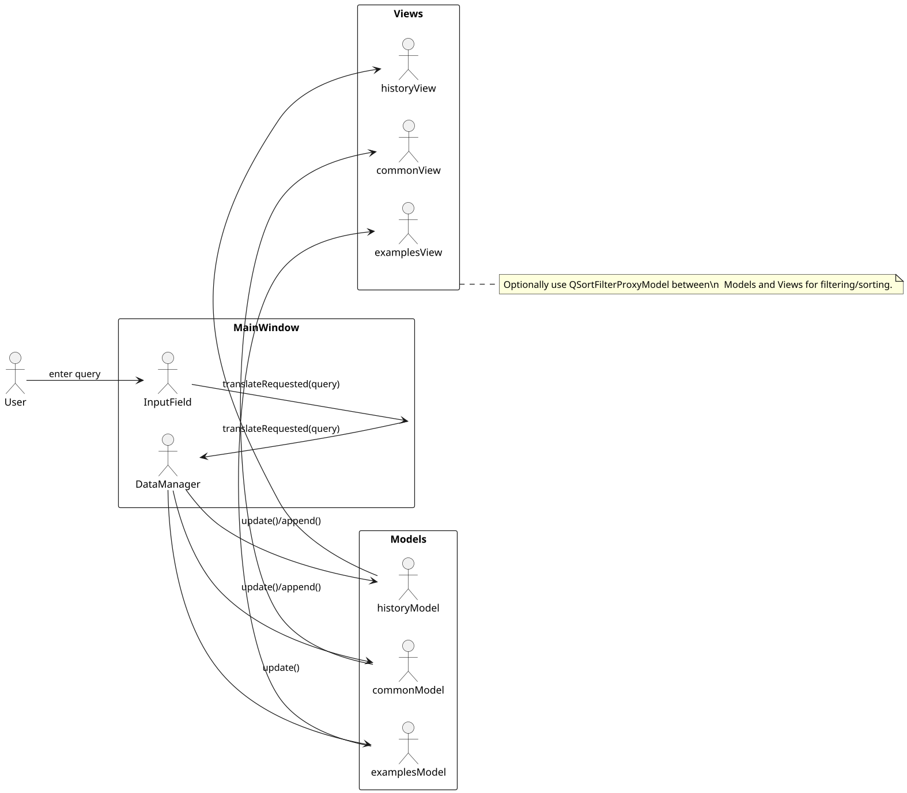
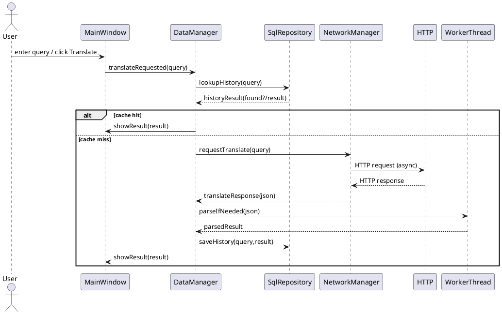

模块设计说明
===========

| 模块名称 | 职责 | 输入 / 输出 | 所用技术 |
|---|---|---|---|
| MainWindow (UI) | MainWindow 负责全部用户交互与界面展示，是应用的入口与事件分发中心。MainWindow 接收用户输入并通过信号/槽将操作转发到业务层，界面本身不承担复杂业务逻辑。界面通过绑定模型（historyModel、commonModel、examplesModel）展示数据，保持视图与数据分离，便于测试与维护。 | 输入：用户查询、按钮事件； 输出：触发 translateRequested 信号、展示模型数据。 | Qt Widgets（QMainWindow、QListView、QTextEdit、QPushButton） |
| DataManager | DataManager 作为控制器/协调者，负责接收来自 UI 的查询请求并执行缓存判断、发起网络请求与分发解析任务。它实现缓存策略（先查询 SQLite 再发起网络请求）并统一处理解析结果与错误，同时负责将结果下发到模型供 UI 展示。为避免阻塞主线程，DataManager 会将耗时解析或批量任务交由 WorkerThread 处理，并通过信号将结果回传主线程。 | 输入：translateRequested(query)、lookup 结果； 输出：translationReady、更新模型、写入 DB 请求。 | C++ 类（信号/槽协调）、调用 SqlRepository 与 NetworkManager |
| SqlRepository (Repository) | SqlRepository 封装所有与 SQLite 的交互，负责数据库连接、建表、增删改查以及事务与错误处理。上层通过该模块进行历史、常用词的持久化操作，避免在业务层散布 SQL 语句。集中数据库访问便于单元测试与将来替换存储实现（例如迁移到远端服务或文件存储）。 | 输入：查 history/common、插入/删除请求； 输出：查询结果、执行状态。 | Qt SQL（QSqlDatabase、QSqlQuery）、SQLite |
| NetworkManager | NetworkManager 封装 QNetworkAccessManager，统一管理 HTTP 请求（翻译 API、词典 API）、请求头、超时和错误重试策略。该模块对上层提供异步接口并在请求完成时发出统一格式的响应信号，使上层只需关注业务解析而无需关心底层网络细节。集中网络逻辑便于实现限流、切换后端服务以及全局错误处理策略。 | 输入：translate API 请求、dictionary API 请求； 输出：原始 JSON / 错误信号。 | Qt Network（QNetworkAccessManager、QNetworkRequest） |
| WorkerThread | WorkerThread 提供后台任务处理能力，用于将耗时操作（如大 JSON 解析、批量例句翻译、TTS 合成）移出主线程，保证 UI 响应性。可基于 QThread 或 Qt Concurrent 实现线程池，并通过信号/槽传递任务与结果。该模块支持任务排队、优先级与取消机制，便于管理并发任务与资源。 | 输入：解析任务、批量翻译任务； 输出：parsedResult、进度/完成信号。 | QThread / Qt Concurrent |
| Model/View (models) | 使用 QStandardItemModel 或自定义 QAbstractListModel 管理 historyModel、commonModel 与 examplesModel，模型负责持有显示文本与元数据（如 db id、时间戳、原文等）。模型在数据变更时发出信号驱动视图刷新，支持排序、过滤与批量更新，从而实现视图与数据解耦。采用 Model/View 结构便于未来扩展（例如分页、远程同步或复杂过滤）。 | 输入：DataManager 更新数据； 输出：供 QListView 等视图展示。 | QStandardItemModel / QAbstractListModel、QListView |

数据库结构设计（SQLite）
--------------------

ER 概述（文本描述）
- 实体：history（查询历史）和 common（常用词）。
- history 存储每次查询的原文、翻译结果与时间戳；common 存储用户添加或自动统计的常用词及其频次。
- 两表之间没有外键关系，但由业务层（DataManager）保持一致性（例如添加常用词不会自动删除历史）。

表结构定义（字段说明）

| 表名 | 字段 | 数据类型 | 说明 |
|---|---|---|---|
| history | id | INTEGER PRIMARY KEY AUTOINCREMENT | 自增主键 |
|  | query | TEXT NOT NULL | 用户查询的原文（词或句子） |
|  | result | TEXT | 翻译结果或解析后的文本 |
|  | timestamp | INTEGER | Unix 时间戳（秒） |
| common | id | INTEGER PRIMARY KEY AUTOINCREMENT | 自增主键 |
|  | word | TEXT NOT NULL UNIQUE | 常用词文本（唯一约束） |
|  | freq | INTEGER DEFAULT 1 | 被使用或添加的频次，用于排序 |

索引与约束建议
- 在 `history(query)` 上建立索引以加速缓存查询（按 query 快速命中）。
- 在 `common(word)` 上加 UNIQUE 约束保证单词唯一，并在 `freq` 上可建索引用于按频次排序（可选）。

SQLite 建表语句（示例）

```sql
-- history: 记录查询历史与结果
CREATE TABLE IF NOT EXISTS history (
  id INTEGER PRIMARY KEY AUTOINCREMENT,
  query TEXT NOT NULL,
  result TEXT,
  timestamp INTEGER
);
CREATE INDEX IF NOT EXISTS idx_history_query ON history(query);
CREATE INDEX IF NOT EXISTS idx_history_timestamp ON history(timestamp);

-- common: 常用词表，word 唯一
CREATE TABLE IF NOT EXISTS common (
  id INTEGER PRIMARY KEY AUTOINCREMENT,
  word TEXT NOT NULL UNIQUE,
  freq INTEGER DEFAULT 1
);
CREATE INDEX IF NOT EXISTS idx_common_freq ON common(freq);
```

示例常用操作（SQL）
- 插入历史（参数化）:
  - INSERT INTO history (query, result, timestamp) VALUES (:q, :r, :t)
- 查询最近的缓存翻译:
  - SELECT result FROM history WHERE query = :q ORDER BY timestamp DESC LIMIT 1
- 增加常用词频次（存在则 +1 否则插入）:
  - UPDATE common SET freq = freq + 1 WHERE word = :w
  - INSERT OR IGNORE INTO common (word, freq) VALUES (:w, 1)

说明
- 本设计将示例句（examples）保持为内存模型（来自词典 API），不持久化存储以节省空间并简化数据模型；如需持久化可以添加 `examples` 表并与 `history` 以 history_id 关联。  
- 将数据库访问集中在 `SqlRepository` 中，可便于事务处理、错误重试与单元测试。

表结构详细定义
----------------

下面为每张表提供更详细的字段规范（包含是否为主键、是否非空、默认值及说明），便于写入设计文档或实现迁移脚本。

### 1) history 表（查询历史）

| 字段 | 类型 | PK | NOT NULL | 默认值 | 说明 |
|---|---:|:--:|:--:|---:|---|
| id | INTEGER | 是 | 是 | AUTOINCREMENT | 自增主键，用于唯一标识历史记录 |
| query | TEXT | 否 | 是 |  | 用户输入的原文（单词或句子），用于缓存匹配 |
| result | TEXT | 否 | 否 | NULL | 翻译或解析后的结果文本 |
| timestamp | INTEGER | 否 | 否 | 0 | Unix 时间戳（秒），记录查询时间，便于排序与清理历史 |

建议索引：
- `idx_history_query (query)` 用于加速按 query 命中缓存；
- `idx_history_timestamp (timestamp)` 用于按时间排序或清理旧记录。

### 2) common 表（常用词）

| 字段 | 类型 | PK | NOT NULL | 默认值 | 说明 |
|---|---:|:--:|:--:|---:|---|
| id | INTEGER | 是 | 是 | AUTOINCREMENT | 自增主键 |
| word | TEXT | 否 | 是 |  | 常用词文本，建议对输入做归一化（小写、去空格）并使用 UNIQUE 约束 |
| freq | INTEGER | 否 | 否 | 1 | 频次统计，用于按常用度排序或建议，插入时默认 1，重复添加时 ++ |

建议索引/约束：
- `UNIQUE(word)` 保证词项唯一；  
- `idx_common_freq (freq)` 用于按频次排序显示热门词。

### 3) examples 表（可选，若需持久化示例）

| 字段 | 类型 | PK | NOT NULL | 默认值 | 说明 |
|---|---:|:--:|:--:|---:|---|
| id | INTEGER | 是 | 是 | AUTOINCREMENT | 示例句主键 |
| history_id | INTEGER | 否 | 是 |  | 关联的 history.id（外键），一条查询可能有多条例句 |
| text | TEXT | 否 | 是 |  | 原始示例句文本 |
| translation | TEXT | 否 | 否 | NULL | 示例句的翻译文本（可选） |
| source | TEXT | 否 | 否 | NULL | 示例来源或 API 标识（例如 dictionaryapi.dev） |

如果使用 examples 表，建议为 `history_id` 加上外键（SQLite 需开启外键支持）以保证引用完整性，并为 `history_id` 建索引用于查询指定历史的例句。

## 2.4 Model/View 设计说明

说明以下内容，并给出示意图（PlantUML 源在项目中 `model_view.puml`，可渲染为 PNG）。

- 使用了哪些 Model：本项目采用 `QStandardItemModel` 作为 `historyModel`、`commonModel` 与 `examplesModel` 的实现，因为数据量不大且操作简单；若需更高效或懒加载，可以自定义继承自 `QAbstractListModel` 或 `QAbstractTableModel` 的模型以提升性能与灵活性。  
- 为什么用 Model/View：Model/View 将数据与视图分离，避免直接把数据塞入控件（如 QListWidget），使得数据变更、排序、过滤不需要直接重建控件；同时方便单元测试、数据来源切换（内存/DB/网络）与多视图共享同一模型。  
- 使用 ProxyModel 过滤数据：可在 `historyModel` 或 `commonModel` 之上插入 `QSortFilterProxyModel`，实现按文本过滤、正则或按频次排序显示。例如：`proxy->setFilterFixedString(query)` 实现按输入过滤，或重载 `filterAcceptsRow` 实现更复杂逻辑。  
- View 绑定 Model：在 UI 中通过 `listView->setModel(historyModel)` 将视图与模型绑定；若使用 proxy，则绑定 `listView->setModel(proxyModel)` 并把 `proxyModel->setSourceModel(historyModel)`。视图会自动响应模型发出的 `dataChanged`、`rowsInserted` 等信号从而刷新显示。

示意图（PlantUML）



使用建议：
- 对于简单列表 `QStandardItemModel` 足够且实现快速；对于大量数据（分页）或高性能需求，建议实现自定义 `QAbstractListModel` 并按需查询数据库。  
- 在需要排序或过滤时，一律使用 `QSortFilterProxyModel` 而非在业务层手动筛选后重建模型，可简化逻辑与提升响应性。  
- 模型中保存元数据（如数据库 id、原文）以便视图交互时能直接获得上下文（例如删除时通过 id 删除 DB 记录）。
 
## 2.5 网络模块设计

说明：

- 使用协议：首选 HTTP/HTTPS（REST 风格或公共翻译端点），通过 `QNetworkAccessManager` 发起异步请求并解析 JSON 响应。若需实时推送或低延迟服务，可考虑使用 WebSocket（Qt WebSockets）或 TCP 长连接；本项目以 HTTP 为主。  
- 请求流程（可生成流程图，项目中已有 PlantUML 源 `network_flow.puml`）：UI 发起查询 → DataManager 查询本地缓存（SqlRepository）→ 缓存未命中则 NetworkManager 发起 HTTP 请求（异步）→ NetworkManager 在 `finished` 处理 `QNetworkReply` 并将响应传回 DataManager → DataManager 根据需要将 JSON 解析任务交给 WorkerThread → 解析完成后保存历史并更新模型，最终通过信号通知 UI 更新界面。  
- 数据接收后如何更新 UI：所有模型或界面更新必须在主线程进行。DataManager 在获得最终结果后应发出信号（例如 `translationReady(query, result)`），MainWindow 在槽中接收并更新 `resultTextEdit` 与模型（historyModel、examplesModel）。若解析发生在后台线程，务必通过信号/槽跨线程传递结果。  
- 异常与超时处理：为请求设置合理超时（可以用 `QTimer` 与 `QNetworkReply::abort()` 配合），在超时或错误时显示本地化提示并提供重试策略；对失败采用指数退避或有限重试以减轻服务压力。统一处理 HTTP 状态码和 `QNetworkReply::error()`，记录错误日志以备排查。  
- 避免阻塞 UI：网络请求为异步，所有耗时计算使用 WorkerThread 或 Qt Concurrent，避免在回调中做重解析或同步 IO 操作导致界面卡顿。对于大量历史数据采用分页或懒加载策略，不一次性加载到模型中。

实现建议与要点：
- 在 `NetworkManager` 中统一管理请求头（User-Agent）、超时、重试与日志；对外提供封装后的异步接口，便于上层调用和切换后台服务。  
- 在发起请求前进行去重（避免对相同 query 发起重复请求），采用一个正在进行请求的集合或请求 id 管理并发。  
- 在处理 `QNetworkReply` 时先检查 `reply->error()` 与 HTTP 状态码，再做 JSON 解析；解析失败时记录原始响应以便调试。  
- 若使用付费 API，请把 API key 配置在外部配置文件或环境变量，不要硬编码在源码中。

流程图（PlantUML 源文件已添加到项目：`network_flow.puml`）



## 2.6 UI 布局设计

本节说明主界面的布局结构、使用的布局管理器以及 UI 元素如何与功能对应（按钮触发后台任务与界面更新逻辑），并解释为什么这样设计能提高可维护性与用户体验。

总体结构（结构树）
- MainWindow (QMainWindow)
  - centralWidget (QWidget)
    - horizontalLayout (QHBoxLayout)
      - leftVBox (QVBoxLayout)
        - inputLayout (QHBoxLayout)
          - inputLineEdit (QLineEdit) — 用户输入单词/句子
          - translateButton (QPushButton) — 触发翻译请求
        - resultTextEdit (QTextEdit, readOnly) — 显示翻译/解析结果
        - examplesLabel (QLabel)
        - examplesListView (QListView) — 显示示例句（绑定 examplesModel）
      - rightTabs (QTabWidget)
        - historyTab (QWidget)
          - historyListView (QListView) — 绑定 historyModel
          - historyButtons (QHBoxLayout) — 包含 删除所选 / 清空历史
        - commonTab (QWidget)
          - commonListView (QListView) — 绑定 commonModel
          - commonButtons (QHBoxLayout) — 包含 添加到常用 / 从常用移除
  - statusbar (QStatusBar)
    - creditLabel (QLabel) — 右下角署名信息

使用的布局管理器与理由
- `QHBoxLayout` 与 `QVBoxLayout`：组合使用实现响应式的左右、上下布局，易于在窗口大小变化时保持控件比例与间距。主布局使用左右的 `QHBoxLayout` 将内容分为主显示区（左）和控制/列表区（右）。  
- `QTabWidget`：把历史与常用放在右侧的标签页中，节省空间并按功能分组，用户切换直观。  
- 局部 `QHBoxLayout`（按钮行）：用于将操作按钮水平排列并对齐到右侧或居中，便于用户快速找到操作入口。

UI 元素与功能对应（事件与信号/槽）
- `translateButton` 点击或输入框回车：触发 `on_translateButton_clicked()`（MainWindow 槽），此槽通过 `DataManager` 或直接使用 `NetworkManager` 发起翻译请求。UI 在发起请求时可调用 `setEnabled(false)` 禁用按钮并显示状态栏“翻译中...”。请求完成或失败后恢复可用并更新 `resultTextEdit`。  
- `historyListView` / `commonListView`：绑定各自模型（historyModel、commonModel），点击条目触发 `onHistoryClicked()` / `on_commonClicked()`，把条目填回 `inputLineEdit` 并可触发自动翻译或显示详情。模型内保存 db id 作为 UserRole 元数据，便于删除时同步数据库。  
- 删除/清空按钮：从模型中读取选中项的 id，通过 `SqlRepository` 删除数据库记录并更新模型。按钮操作应在完成后清除 selection 并在状态栏提示结果。  
- `examplesListView`：只读显示示例句，条目可支持双击复制或右键菜单（复制、复制译文、查词来源）。建议把译文与原句同时显示，或采用两行展示。

样式与交互细节
- 结果区设置为只读 (`setReadOnly(true)`)，避免用户误修改缓存内容；提供“复制”按钮以便快速复制结果。  
- 输入框占位文本提示（placeholder）说明输入要求；对长文本或特殊字符做长度限制与预处理（trim、URL encode）。  
- 在网络请求期间对按钮与输入框进行临时禁用以避免重复请求；同时显示状态栏或进度指示器（QProgressBar / spinner）为用户提供反馈。  
- 错误提示：建议在状态栏显示简短错误信息，并在需要时弹出 `QMessageBox` 提供重试/详情选项。

可访问性与可扩展性
- 把 UI 逻辑保持在 `MainWindow` 层，具体业务放在 `DataManager`/`SqlRepository`/`NetworkManager` 中：便于测试、重用与替换后端。  
- 模型-视图分离后，若未来需要支持多窗口或导出功能（CSV/JSON），只需在业务层增加接口而无须重构 UI 布局。  

示意截图与手绘建议
- 建议在报告中插入主窗口截图或 draw.io 绘制的线框图，图下附一段简要文字说明（即本节内容的摘要）。  
- 若需要，我可以把当前运行界面截图导出并放入项目，或生成一张线框图 PNG（使用 PlantUML/Draw.io）。

## 3.1 系统界面

下面展示系统界面应包含的截图与说明（示例为占位路径，请用实际运行截图替换 `assets/...` 下的文件）。每张图下至少两句话说明界面用途与关键交互点。

### 主界面（`assets/main_window.png`）
- 说明：主界面汇集查询输入、翻译按钮与结果展示区，是用户的主要操作入口；用户在顶部输入框输入单词或句子，点击“翻译”后结果在左侧结果区显示。  
- 说明：右侧为“历史”和“常用”标签页，便于快速访问以前的查询或频繁使用的词；示例区显示来自词典 API 的例句，提供上下文参考并支持复制操作。

### 功能界面 - 历史管理（`assets/history.png`）
- 说明：历史界面列出按时间排序的最近查询记录，用户可选中条目进行删除或回填查询框以重新查看翻译结果。  
- 说明：界面提供“删除所选”和“清空历史”按钮，删除操作会同步回 SQLite 数据库并更新模型，操作完成后在状态栏显示提示信息。

### 功能界面 - 常用词管理（`assets/common.png`）
- 说明：常用词界面展示用户已添加或系统统计的高频词，支持按频次排序与一键添加/删除操作，方便用户快速复查常查词汇。  
- 说明：点击常用词会把该词填回输入框并自动触发翻译，常用词表在数据库中有唯一约束以避免重复项。

替换与提交提示：
- 请把上述占位图片替换为你本地运行后截图（建议分辨率与 README 相适配），放在 `assets/` 目录并提交到仓库；如需我代为截图并提交，请允许我运行渲染（或你将截图文件上传到项目，我会把路径替换并提交）。

## 3.3 代码版本管理提交日志

必需提供项：
- Git 提交记录截图（终端或 GUI），展示至少 20 次提交，图像放在 `assets/git_log.png`。  
- 在 README 中列出并说明若干关键 commits（至少 3 个），解释每个提交的作用与影响。

如何生成提交记录截图（命令行示例）
- 在仓库根目录运行：
  - `git log --oneline --graph --decorate --abbrev-commit -n 50 > git_log.txt`（会把最近 50 条写入文本，便于截屏或复制）  
  - 更可读带日期的格式：`git log --pretty=format:"%h %ad | %s%d [%an]" --graph --date=short -n 50`  
- 用终端或 GUI（例如 GitKraken、SourceTree、GitHub Desktop）截屏并保存为 `assets/git_log.png`。

提交信息规范建议（方便评审）
- 使用语义化前缀：`add:`, `fix:`, `refactor:`, `docs:`, `test:`, `chore:`。  
- 每个提交信息应简洁说明改动目的与范围，例如：`fix: avoid duplicate deletion in history list`、`add: examples fetching and parsing`、`refactor: extract NetworkManager`。

在 README 中标注关键 commits（示例模板）
- `abc1234` — add: implement translation request and display — 实现翻译请求、解析并在结果区显示，首次联通在线 API。  
- `def5678` — add: sqlite caching and history persistence — 增加 SqlRepository、history 表和缓存逻辑，查询优先本地缓存。  
- `ghi9012` — fix: dedupe delete actions in history view — 修复历史/常用删除时重复删除的问题并更新模型同步逻辑。  

注意事项
- 确保截图清晰可读；对于命令行输出可在终端中放大字体再截屏。  
- 如果提交次数不足 20 次，可通过拆分较大改动为多个小提交（例如：添加注释、增加日志、修复小 bug），满足次数要求并保留语义明确的提交信息。  

完成后请把 `assets/git_log.png` 上传到仓库或告知我需要我代为生成截图并提交（我可以在本地运行生成并提交 PNG）。

